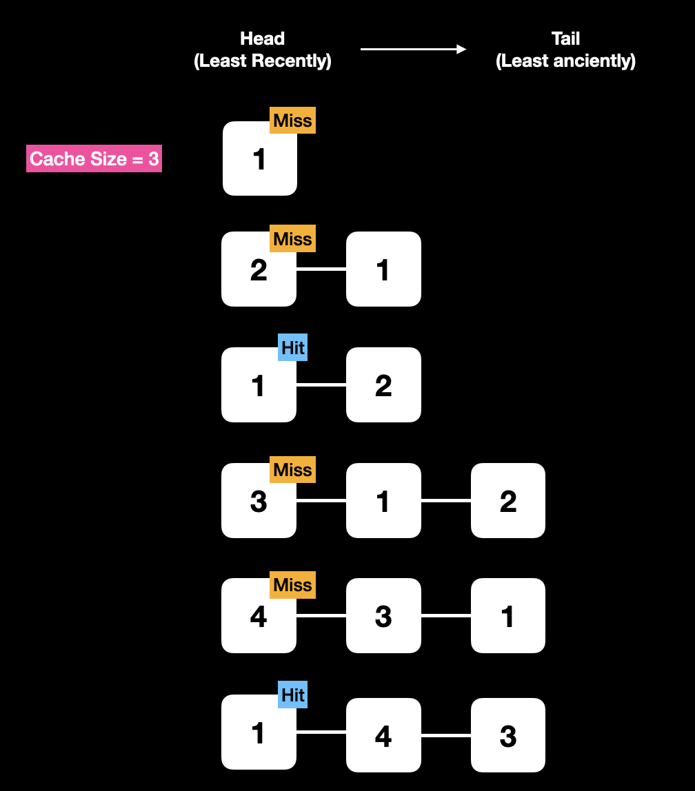
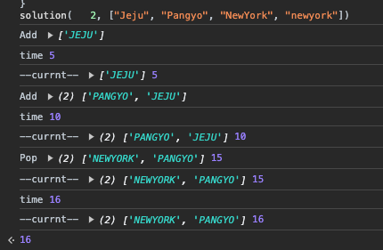

### Description
지도개발팀에서 근무하는 제이지는 지도에서 도시 이름을 검색하면 해당 도시와 관련된 맛집 게시물들을 데이터베이스에서 읽어 보여주는 서비스를 개발하고 있다.
이 프로그램의 테스팅 업무를 담당하고 있는 어피치는 서비스를 오픈하기 전 각 로직에 대한 성능 측정을 수행하였는데, 제이지가 작성한 부분 중 데이터베이스에서 게시물을 가져오는 부분의 실행시간이 너무 오래 걸린다는 것을 알게 되었다.
어피치는 제이지에게 해당 로직을 개선하라고 닦달하기 시작하였고, 제이지는 DB 캐시를 적용하여 성능 개선을 시도하고 있지만 캐시 크기를 얼마로 해야 효율적인지 몰라 난감한 상황이다.

어피치에게 시달리는 제이지를 도와, DB 캐시를 적용할 때 캐시 크기에 따른 실행시간 측정 프로그램을 작성하시오.

### 입력 형식
* 캐시 크기(cacheSize)와 도시이름 배열(cities)을 입력받는다.
* cacheSize는 정수이며, 범위는 0 ≦ cacheSize ≦ 30 이다.
* cities는 도시 이름으로 이뤄진 문자열 배열로, 최대 도시 수는 100,000개이다.
* 각 도시 이름은 공백, 숫자, 특수문자 등이 없는 영문자로 구성되며, 대소문자 구분을 하지 않는다. 도시 이름은 최대 20자로 이루어져 있다.

### 출력 형식
* 입력된 도시이름 배열을 순서대로 처리할 때, "총 실행시간"을 출력한다.

### 조건
* 캐시 교체 알고리즘은 LRU(Least Recently Used)를 사용한다.
* cache hit일 경우 실행시간은 1이다.
* cache miss일 경우 실행시간은 5이다.

### 입출력 예
| cache size |                                          cities                                          | 실행시간 | 
|------------|------------------------------------------------------------------------------------------|--------|
|      3     | ["Jeju", "Pangyo", "Seoul", "NewYork", "LA", "Jeju", "Pangyo", "Seoul", "NewYork", "LA"]	|   50   |
|      3	   | ["Jeju", "Pangyo", "Seoul", "Jeju", "Pangyo", "Seoul", "Jeju", "Pangyo", "Seoul"]	      |   21   |
|      2	   | ["Jeju", "Pangyo", "Seoul", "NewYork", "LA", "SanFrancisco", "Seoul", "Rome", "Paris", "Jeju", "NewYork", "Rome"] |	60  |
|      5	   | ["Jeju", "Pangyo", "Seoul", "NewYork", "LA", "SanFrancisco", "Seoul", "Rome", "Paris", "Jeju", "NewYork", "Rome"] |	52  |
|      2	   | ["Jeju", "Pangyo", "NewYork", "newyork"]	                                                |   16   |
|      0	   | ["Jeju", "Pangyo", "Seoul", "NewYork", "LA"]                                             |  	25   |

 

---
### Point ⍨
＞   
＞   

### Total elapsed time ⍩
> 1시간

### New Thing
본 문제는 조건에도 명시되어 있듯이 LRU 알고리즘을 사용하여 문제를 풀어야 한다.

**LPU(Least Recently Used) 란?**  
가장 오랫동안 참조되지 않은 페이지를 교체하는 방식이다.
LRU는 사용된지 가장 오래된 페이지는 앞으로도 사용될 확률이 낮다는 가설에 의해 만들어진 알고리즘이다.

 

그림처럼, 캐시에 최신 캐시 순서대로 쌓이는 데, 이때 캐시가 가득 찼을 때는 가장 오랫동안 참조되지 않은 페이지를 없앤 후 새로운 캐시를 저장하는 방식인 것이다.  
나의 경우 LPU를 이해하자마자 Queque 자료 구조가 떠올랐고, 때문에 Linked List 방식으로 문제를 풀 수 있겠다는 생각을 하였다.

어떤 분들은 이중 연결 리스트로도 푸신 것 같다!
> LPU 알고리즘을 구현할 때는 Doubly Linked List를 사용하고 head에 가까운 node 일수록 가장 최근에 참조된 페이지, tail에 가까운 node 일수록 가장 오랫동안 참조되지 않는 페이지이다.  
LRU의 개념에 따라 cache size를 넘어서게 된다면 tail 에 가까운 페이지가 먼저 삭제시키면 된다.

### Process
 