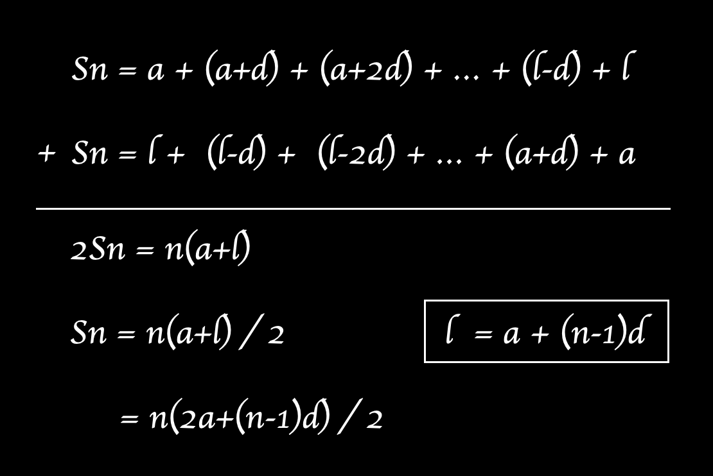

### Description
Finn은 요즘 수학공부에 빠져 있습니다. 수학 공부를 하던 Finn은 자연수 n을 연속한 자연수들로 표현 하는 방법이 여러 개라는 사실을 알게 되었습니다. 예를들어 15는 다음과 같이 4가지로 표현 할 수 있습니다.

1 + 2 + 3 + 4 + 5 = 15 <br />
4 + 5 + 6 = 15 <br />
7 + 8 = 15 <br />
15 = 15 <br />
자연수 n이 매개변수로 주어질 때, 연속된 자연수들로 n을 표현하는 방법의 수를 return하는 solution를 완성해주세요.

### 제한사항
* n은 10,000 이하의 자연수 입니다.

### 입출력 예
|    n    |	 result |
|---------|---------|
|   15    |    4    |

<br />

---
### Point ⍨
＞ 연속된 자연수로 n을 만들어야 한다. <br />
＞ 그 방법의 수를 반환한다.

### Total elapsed time ⍩
> 1시간 30분

### New Thing
이 문제를 빠르게 풀기 위해서는 수학적 접근이 필요하다. <br />

n 이하인 숫자 a부터 k개의 연속된 숫자의 합이 n이라고 가정한다면
```javascript
a + (a+1) + (a+2) + ... + (a+k-1) = n
```
이런 식이 나오기 때문에 '등차수열의 합 공식'으로 문제를 풀어갈 수 있다.
<br />
위 공식 원리대로 풀면 아래와 같은 결과를 얻을 수 있다.
> k(2a + (k-1)) / 2 = n

n의 값은 이미 알고있기 때문에 해당 식을 a의 값을 구하기 위한 식으로 정리한다. 
> a = n / k + (1-k) / 2

a가 자연수라는 조건이 성립하기 위해서는 
1. n / k가 자연수여야 한다. <br />
=> k가 n의 약수여야 한다.
2. (1-k) / 2가 자연수여야 한다. <br />
=> 2로 나누어 떨어지기 위해서는 짝수여야 한다. 그러기위해선 k는 홀수여야 한다.

즉, 위 조건대로 n의 약수이면서 홀수인 k를 찾으면 해당 문제를 해결할 수 있다.

그러나 "자연수들의 합으로 표현할 수 있는 방법의 수"와 
"주어진 자연수의 약수 중에서 홀수인 수의 개수"의 상관 관계까지 이해하기에는 어려움이 있다...