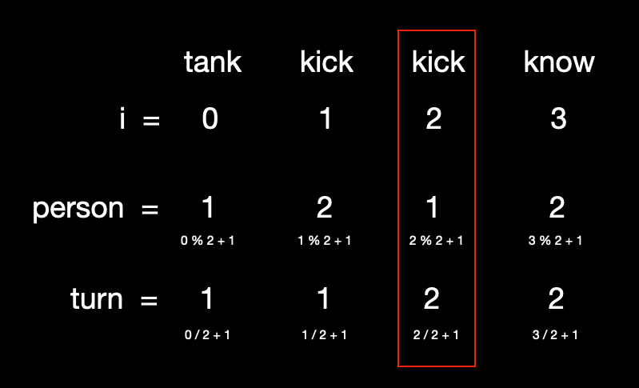

### Description
Suppose that "n" persons that are each given a number from 1 through "n" are playing a game of English word relay. English word relay is played based on the following rules.

1. Starting from person number 1, each person says a word in turn.
2. After the last person says a word, person number 1 starts again.
3. A person should say a word that starts with the last character of the previously said word.
4. A person cannot say a word that has already been said.
5. Words with one character are not valid.

The following shows a situation where 3 persons are playing English word relay.

tank → kick → know → wheel → land → dream → mother → robot → tank

The procedure of the word relay above is as follows.

* Person number 1 says tank at the first turn.
* Person number 2 says kick at the first turn.
* Person number 3 says know at the first turn.
* Person number 1 says wheel at the second turn.
* (Continued)

As the word relay continues, person number 3 is eliminated because the word tank, said on the third turn, had already appeared.

With the number of people "n" and the words said "words" as parameters, write a function "solution" to return the number given to the first dropout and in which turn he is eliminated.

### 제한사항
* The number of participants in the word relay "n" is a natural number between 2 and 10.
* "words" is an array containing words said in the word relay and its length is more than "n" and less than 100.
* The length of the words is between 2 and 50.
* All words consist of lower-case letters only.
* You do not need to consider the meaning of the words used in the word relay.
* Return an answer in [ number, turn ] format.
* If there is no dropout with the given words, return [0, 0].

### 입출력 예
|    n   |                                        words                                     |  return |
|--------|----------------------------------------------------------------------------------|---------|
|   3	 |	["tank", "kick", "know", "wheel", "land", "dream", "mother", "robot", "tank"]	|  [3,3]  |
|   5	 |  ["hello", "observe", "effect", "take", "either", "recognize", "encourage", "ensure", "establish", "hang", "gather", "refer", "reference", "estimate", "executive"]	                                            |  [0,0]  |
|   2	 |            ["hello", "one", "even", "never", "now", "world", "draw"]	            |  [1,3]  |

<br />

---
### Point ⍨
＞ 매개변수로 주어지는 n은 참가자 수를 의미한다. <br />
＞ [ number, turn ] 형태로 반환한다. <br />
＞ 여기에서 number은 몇 번째 사람이 틀렸는지 그 번호이고, turn은 전체 순회가 몇 번째인지를 의미힌다. <br />
＞ 같은 단어를 말한 사람이나, 끝말이 연결되지 않는 사람을 찾아서 반환해야한다.

### Total elapsed time ⍩
> 1시간 30분

### Code additional explanation
```javascript
answer[0] = i % n + 1;
answer[1] = Math.floor(i / n) + 1;
```
반환 값을 위 식처럼 나온 이유는 무엇일까?

예로 들어,
> n = 2 <br />
words = [tank, kick, kick, know]

<br />

그림처럼 규칙을 발견할 수 있다. 이때 몫의 경우 소수점이 나오기 때문에 Math.floor을 사용하여 소수점 이하를 버려준다.